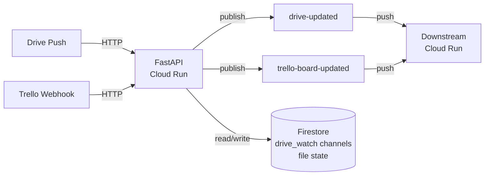
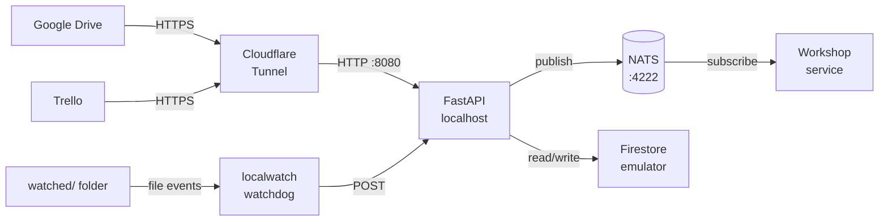

# Webhook

FastAPI service that receives Drive push notifications and Trello webhooks, then publishes events to Pub/Sub topics for downstream processing.

Two runtime modes:

| Mode | `ENVIRONMENT` | Drive | Firestore | Pub/Sub |
|---|---|---|---|---|
| **gcp** (production) | `gcp` | Google Drive API | Cloud Firestore | Cloud Pub/Sub |
| **local** (development) | `local` | `localdrive` — watches a local folder | Firestore emulator | NATS |

The mode is selected by the `ENVIRONMENT` variable. All code paths are identical — `localdrive`, `localwatch`, and the emulators are drop-in replacements that get swapped in at import time.

## Prerequisites

- Python 3.12
- [pipenv](https://pipenv.pypa.io/)
- Docker (for deploys and local dev with docker-compose)
- `gcloud` CLI (for emulators and deploys)

All infrastructure runs in Docker containers. No local emulator installs needed.

Inspect local firestore database at
```
http://localhost:8556/v1/projects/test-project/databases/(default)/documents/drive_watch?pageSize=10
```


## Install

```bash
pipenv install --dev
```

The `.env` file holds secrets and GCP-specific config. It is **not** needed for local mode when using docker-compose (which sets the required variables itself).

## Run locally (with Docker Compose + NATS)

### First-time setup

1. **Install dependencies and create `.env`:**

   ```bash
   pipenv install --dev
   cp .env.example .env   # then edit with your values
   ```

2. **Create the Cloudflare Tunnel** (reads credentials from your `.env` file):

   ```bash
   make tunnel-init
   ```

   This runs `terraform apply` targeting only the Cloudflare resources. Credentials are pulled from `.env` automatically — no manual exports needed.

3. **Save the tunnel token** to your `.env` file:

   ```bash
   make tunnel-token
   # Output: CLOUDFLARE_TUNNEL_TOKEN=<token>
   # Copy that line into your .env file, replacing the empty CLOUDFLARE_TUNNEL_TOKEN=
   ```

4. **Set your tunnel hostname** in `.env` — replace `localhost` URLs with the tunnel domain:

   ```env
   DRIVE_WEBHOOK_URL=https://webhook.example.com/drive/updated
   TRELLO_WEBHOOK_URL=https://webhook.example.com/trello/updated
   ```

   The domain is whatever you set as `cloudflare_tunnel_domain` in `infra/terraform.tfvars`.

### Daily start

```bash
make tunnel-up
```

This starts NATS, Firestore, the webhook app, and the Cloudflare Tunnel daemon — all in Docker. Code is volume-mounted with `--reload` for hot-reload.

Verify everything is up:

```bash
# Health check via tunnel (public internet)
curl https://webhook.example.com/health
# → {"status":"ok"}

# Health check locally
curl http://localhost:8080/health
# → {"status":"ok"}
```

### What's running

| Container | Port | Purpose |
|---|---|---|
| `webhook-nats` | 4222 | NATS message broker (local pub/sub) |
| `webhook-firestore` | 8556 | Firestore emulator |
| `webhook-app` | 8080 | FastAPI webhook service |
| `webhook-cloudflared` | — | Cloudflare Tunnel daemon (exposes :8080 publicly) |

On startup the app:
- Creates/verifies the NATS connection (`ensure_topics`)
- Starts a watchdog observer on `WATCH_FOLDER_LOCAL` → file changes POST to `/drive/updated`
- **Registers a real Trello webhook** (because `CLOUDFLARE_TUNNEL_ENABLED=True`) pointing at the tunnel URL

### Running without the tunnel

If you don't need external access (just local file watching + NATS), set `CLOUDFLARE_TUNNEL_ENABLED=False` in `.env` and run:

```bash
make docker-up
```

Trello webhook registration is skipped when the tunnel is disabled.

### Stop

```bash
make tunnel-down
# or: docker compose --profile tunnel down
```

### Workshop (downstream consumer)

To also run the workshop service that consumes events from NATS:

```bash
make tunnel-up                        # start webhook + nats + tunnel
cd ../workshop && docker compose up -d  # start workshop (joins aibiz-local-dev network)
```

Both projects share the `aibiz-local-dev` Docker network. The workshop subscribes to NATS subjects `drive-updated` and `trello-board-updated`.

## Tests

```bash
make test
```

Starts NATS via Docker Compose, runs the test suite, and cleans up.

## Lint

```bash
make lint
```

Runs ruff format and check with auto-fix.

## Scripts

| Script | Purpose |
|---|---|
| `scripts/inspect_drive.py` | Inspect the watched folder — shows metadata and lists files |
| `scripts/list_channels.py` | Show the active Drive drive_watch channel stored in Firestore |

```bash
pipenv run python scripts/inspect_drive.py
pipenv run python scripts/list_channels.py
```

## Architecture

### Production (GCP)



### Local (with Cloudflare Tunnel)



- `POST /drive/updated` — Drive push notifications. Lists changes via the Drive API, publishes events to the `drive-updated` Pub/Sub topic.
- `POST /trello/updated` — Trello webhooks. Publishes the raw payload to the `trello-board-updated` Pub/Sub topic.
- `GET /health` — Liveness check.

Pub/Sub message schemas are in `webhook/schemas.py`.

## Infrastructure

Infrastructure is defined in `infra/` (Terraform):

- Cloud Run service (0–10 instances, 256 MiB, 60s timeout)
- Artifact Registry (Docker repo)
- Pub/Sub topics (`drive-updated`, `trello-board-updated`) with push subscriptions
- Firestore for drive_watch channel state

### First-time setup

```bash
cd infra
cp terraform.tfvars.example terraform.tfvars   # edit with your values
terraform apply
```

### Deploy

```bash
./deploy.sh
```

Builds the Docker image (`linux/amd64`), pushes to Artifact Registry, and deploys to Cloud Run. Prints the service URL on completion.
