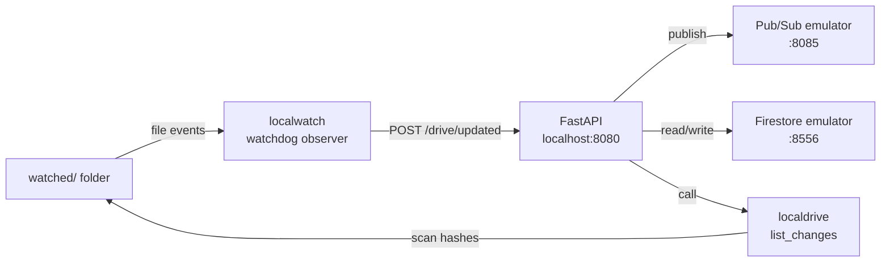
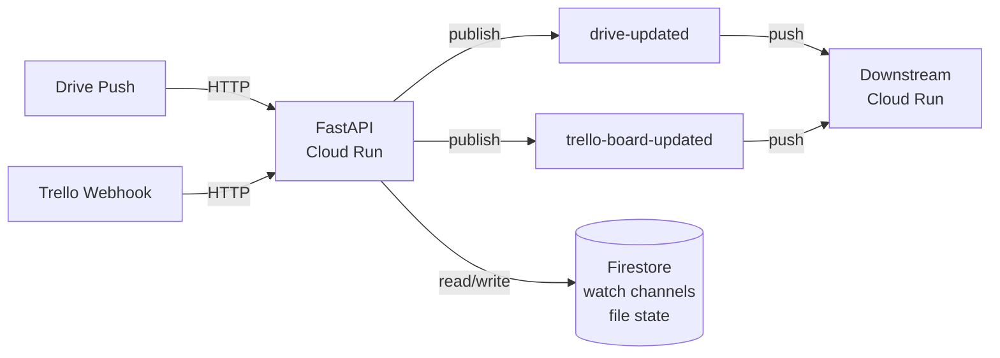

# Webhook

FastAPI service that receives Drive push notifications and Trello webhooks, then publishes events to Pub/Sub topics for downstream processing.

Two runtime modes:

| Mode | `ENVIRONMENT` | Drive | Firestore | Pub/Sub |
|---|---|---|---|---|
| **gcp** (production) | `gcp` | Google Drive API | Cloud Firestore | Cloud Pub/Sub |
| **local** (development) | `local` | `localdrive` — watches a local folder | Firestore emulator | Pub/Sub emulator |

The mode is selected by the `ENVIRONMENT` variable. All code paths are identical — `localdrive`, `localwatch`, and the emulators are drop-in replacements that get swapped in at import time.

## Prerequisites

- Python 3.12
- [pipenv](https://pipenv.pypa.io/)
- Docker (for deploys and local dev with docker-compose)
- `gcloud` CLI (for emulators and deploys)

Install the emulator components (one-time):

```bash
gcloud components install pubsub-emulator
gcloud components install firestore-emulator
```

## Install

```bash
pipenv install --dev
```

The `.env` file holds secrets and GCP-specific config. It is **not** needed for local mode when using docker-compose (which sets the required variables itself).

## Run locally (with emulators)

Set `ENVIRONMENT=local` and start the two emulators, then the app:

```bash
# Terminal 1 — Pub/Sub emulator (port 8085)
gcloud beta emulators pubsub start --project=test-project

# Terminal 2 — Firestore emulator (port 8556)
gcloud beta emulators firestore start --host-port=localhost:8556

# Terminal 3 — the app
ENVIRONMENT=local \
PUBSUB_EMULATOR_HOST=localhost:8085 \
FIRESTORE_EMULATOR_HOST=localhost:8556 \
GCP_PROJECT_ID=test-project \
WATCH_FOLDER_LOCAL=watched \
WEBHOOK_URL=http://localhost:8080 \
pipenv run uvicorn webhook.main:app --reload --port 8080
```

On startup the `watched/` folder is created at the project root. Any file change inside it triggers the same `/drive/updated` flow that a real Drive push notification would.



## Docker Compose

Starts everything in containers — Pub/Sub emulator, Firestore emulator, and the webhook app:

```bash
make docker-up
# or: docker compose up -d --build
```

Code is volume-mounted with `--reload` for hot-reload. The `watched/` folder is created automatically.

To also run the **workshop** downstream service:

```bash
# Start webhook + emulators first
docker compose up -d --build

# Then in the workshop repo
cd ../workshop
docker compose up -d
```

Both projects share the `aibiz-local-dev` Docker network. The workshop reaches the emulators at `pubsub:8085` and `firestore:8556`.

## Tests

```bash
make test
```

Starts the Pub/Sub emulator (Firestore is mocked), runs the test suite, and cleans up.

## Lint

```bash
make lint
```

Runs ruff format and check with auto-fix.

## Scripts

| Script | Purpose |
|---|---|
| `scripts/inspect_drive.py` | Inspect the watched folder — shows metadata and lists files |
| `scripts/list_channels.py` | Show the active Drive watch channel stored in Firestore |

```bash
pipenv run python scripts/inspect_drive.py
pipenv run python scripts/list_channels.py
```

## Architecture



- `POST /drive/updated` — Drive push notifications. Lists changes via the Drive API, publishes events to the `drive-updated` Pub/Sub topic.
- `POST /trello/updated` — Trello webhooks. Publishes the raw payload to the `trello-board-updated` Pub/Sub topic.
- `GET /health` — Liveness check.

Pub/Sub message schemas are in `webhook/schemas.py`.

## Infrastructure

Infrastructure is defined in `infra/` (Terraform):

- Cloud Run service (0–10 instances, 256 MiB, 60s timeout)
- Artifact Registry (Docker repo)
- Pub/Sub topics (`drive-updated`, `trello-board-updated`) with push subscriptions
- Firestore for watch channel state

### First-time setup

```bash
cd infra
cp terraform.tfvars.example terraform.tfvars   # edit with your values
terraform apply
```

### Deploy

```bash
./deploy.sh
```

Builds the Docker image (`linux/amd64`), pushes to Artifact Registry, and deploys to Cloud Run. Prints the service URL on completion.
